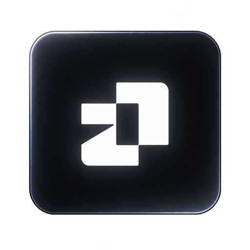
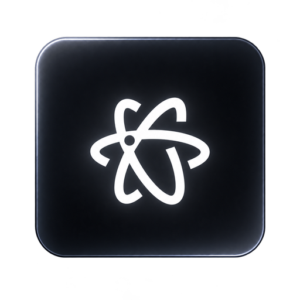
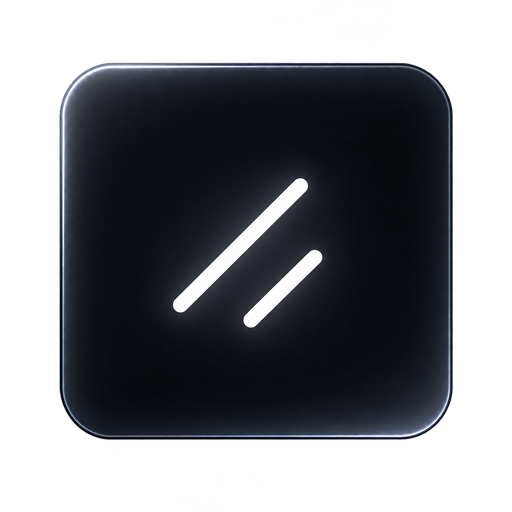
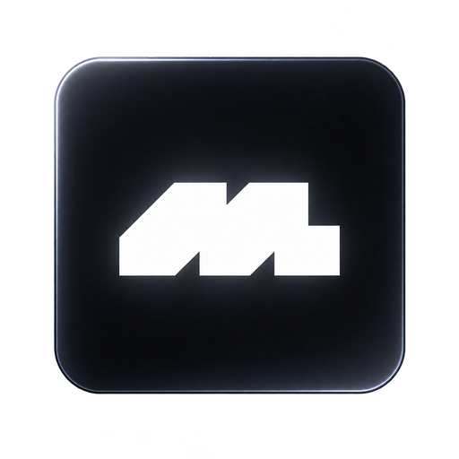

<div align="center">
  

  # Col

  **Sol could not do it himself, so we made Col.**

  A community-maintained directory for finding the right UI library without losing an afternoon to open tabs.

  [](https://github.com/screen-gd/Col/stargazers)
  [](https://github.com/screen-gd/Col/issues)
  [](https://github.com/screen-gd/Col/pulls)
  [](https://nextjs.org)
  [](https://www.typescriptlang.org)

  [Request a library](https://github.com/screen-gd/Col/issues/new?template=library-request.yml) ·
  [Request a feature](https://github.com/screen-gd/Col/issues/new?template=feature-request.yml) ·
  [Report a bug](https://github.com/screen-gd/Col/issues/new?template=bug-report.yml) ·
  [Contribute](CONTRIBUTING.md)
</div>

<br />

<div align="center">
  
  
  
  
  
</div>

## What Col does

Col organizes UI libraries by category, stack, and use case. Search from the homepage, then compare matching libraries in the directory.

- Search by name, keyword, category, stack, or use case.
- Filter libraries without leaving the directory.
- Save useful libraries locally.
- Open the official website or documentation from each listing.
- Contribute missing libraries through a focused pull request.

Col catalogs **libraries**, not individual components.

## Run it locally

Requirements: [Node.js 20.9+](https://nodejs.org) and npm.

```bash
git clone https://github.com/screen-gd/Col.git
cd Col
npm install
npm run dev
```

Open the local URL printed in the terminal (usually [http://localhost:3000](http://localhost:3000)).

Before opening a pull request:

```bash
npm run build
```

## Request something

Use the matching issue form. One focused request per issue makes discussion and review easier.

### Request a library

[Open a library request](https://github.com/screen-gd/Col/issues/new?template=library-request.yml) when a useful UI library is missing.

Include:

- the library name and official URL;
- what it provides and who it helps;
- its supported stacks;
- the closest Col category and use cases;
- confirmation that it is maintained and publicly accessible.

Search [existing libraries](data/libraries.ts), [issues](https://github.com/screen-gd/Col/issues), and [pull requests](https://github.com/screen-gd/Col/pulls) first.

### Request a feature

[Open a feature request](https://github.com/screen-gd/Col/issues/new?template=feature-request.yml) for improvements to discovery, comparison, contribution, accessibility, or the library detail experience.

Explain the problem before proposing the interface. Include the expected outcome and any useful references.

### Report a bug

[Open a bug report](https://github.com/screen-gd/Col/issues/new?template=bug-report.yml) with:

- the page or action that failed;
- exact reproduction steps;
- expected and actual behavior;
- browser, operating system, and viewport;
- screenshots, recordings, or console errors when relevant.

Do not include secrets, tokens, private URLs, or personal information.

## Add a library with a pull request

Library-only pull requests should be small and should not redesign unrelated parts of the site.

1. Fork the repository and create a focused branch.
2. Add one entry to [`data/libraries.ts`](data/libraries.ts).
3. Reuse the existing category, stack, and use-case values when possible.
4. Keep the description factual and short.
5. Confirm the URL points to the official project.
6. Run `npm run build`.
7. Open a pull request using the provided template.

```ts
{
  name: "Library name",
  slug: "library-name",
  description: "A factual one-sentence description of what the library provides.",
  url: "https://library.example",
  category: "Component Library",
  stacks: ["React", "TypeScript"],
  useCases: ["Rapid Prototyping"],
  tags: ["accessible", "copy paste"],
}
```

The `slug` must be unique, lowercase, and kebab-case. See [CONTRIBUTING.md](CONTRIBUTING.md) for the full checklist.

## Dedicated library pages

Every library has a dedicated Col page with:

- a clear overview and best-fit use cases;
- supported stacks and key capabilities;
- official documentation, repository, and installation links;
- useful comparisons and alternatives;
- a copyable setup prompt for coding agents.

### Agent setup prompt

Library pages provide a prompt based on this structure:

```text
Help me add [LIBRARY] to my project.

Project context:
- Framework: [FRAMEWORK]
- Language: [LANGUAGE]
- Styling: [STYLING SYSTEM]
- Package manager: [PACKAGE MANAGER]

Use the current official [LIBRARY] documentation. Inspect the existing project before changing files. Install only the required packages, follow the project's established patterns, preserve accessibility, and avoid replacing unrelated code.

After implementation:
1. Summarize the files changed.
2. Explain any configuration added.
3. Run the project's type-check and build commands.
4. Call out any manual setup still required.
```

When editing a detail page, keep the prompt specific to that library and link every installation claim to official documentation.

## Project structure

```text
app/                  Routes, layout, and global styles
components/           Search, filters, cards, header, and shared UI
data/libraries.ts     The curated library registry
data/library-details/ Per-library detail page content, one file per slug
public/brand/         Col brand assets
public/hero-logos/    Library artwork used by the homepage
.github/              Issue forms and pull request guidance
```

## UI components

Application controls use the components in [`components/ui`](components/ui). Use the existing `Button`, `Input`, `Tabs`, and `DropdownMenu` before adding another control. Keep product-specific layout and behavior in `components/`, and keep visual variants in `components/ui/` when the standard component does not cover them.

`components.json` configures shadcn/ui. The components are owned by this repository and may use Radix primitives internally for keyboard and accessibility behavior. Theme colors for those components live in `app/globals.css`.

## Built with

[Next.js](https://nextjs.org) · [React](https://react.dev) · [TypeScript](https://www.typescriptlang.org) · [Tailwind CSS](https://tailwindcss.com) · [shadcn/ui](https://ui.shadcn.com) · [Radix UI](https://www.radix-ui.com) · [Lucide](https://lucide.dev)

## Community

Be clear, constructive, and respectful. Contributions are welcome whether you are adding a library, improving metadata, fixing a bug, or making discovery easier.

Col is licensed under the [MIT License](LICENSE).

<div align="center">
  <strong>Find better tools. Build better interfaces.</strong>
</div>
